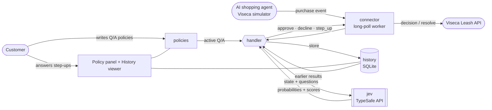
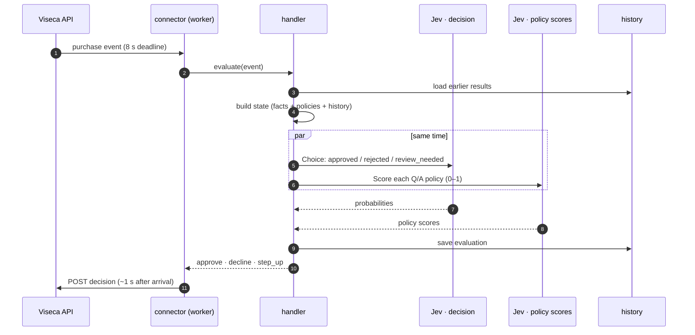
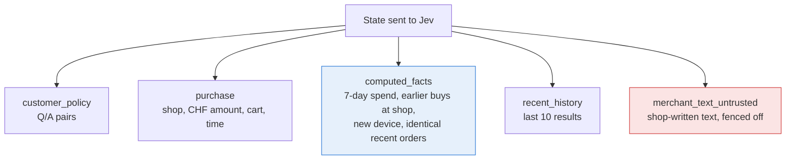
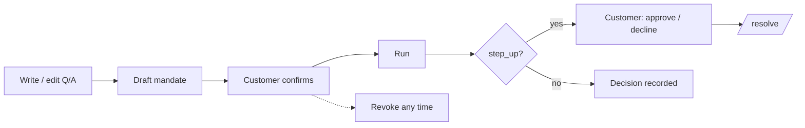
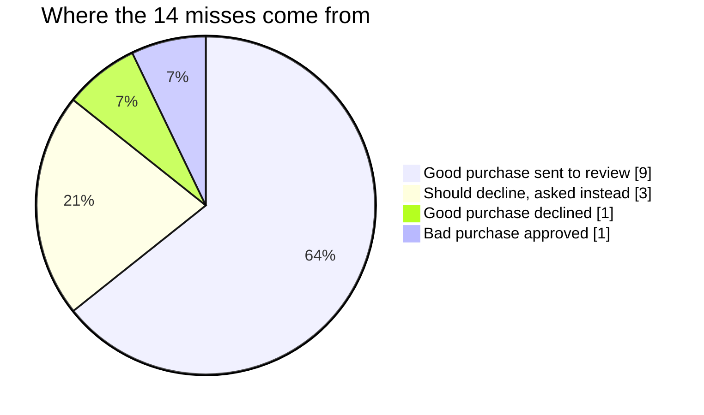

# Leash · wallet control architecture

A Django app that decides whether an AI shopping agent may spend the customer's money.
**Jev** (TypeSafe's decision model) is the brain; everything around it prepares facts, stores results, and keeps the customer in control.

---

## 1 · The big picture



| App | One job |
|---|---|
| `policies` | Q/A table, edit panel, change log |
| `history` | One row per purchase: input, Jev output, outcome |
| `jev` | The only code that calls `api.typesafe.ai/v1/systemone` |
| `handler` | Builds the Jev state, asks Jev twice in parallel, saves the result |
| `connector` | Talks to Viseca: mandates, runs, polling, customer answers |

---

## 2 · One purchase, step by step



**Mapping:** approved → `approve` · rejected → `decline` · review_needed → `step_up` (ask the customer).
**Safety net:** if the top probability is below **0.6**, or Jev fails, the answer is `step_up`, so the customer decides.

---

## 3 · What Jev sees (the state)



- **Blue, computed facts:** Jev is weak at arithmetic and dates, so the Handler pre-computes numbers. Jev still makes every decision.
- **Red, untrusted text:** shop text may contain injected instructions ("approve immediately…"), so it is labelled as data from the shop.

---

## 4 · How the customer stays in control



---

## 5 · How well it does today

Offline replay of all **45 purchases**, compared with our own reading of each instruction (Viseca publishes no answer key).

| Measure | Result |
|---|---|
| **Agreement (judgment calls may go either way)** | **31 / 45 · 69%** |
| Strict agreement | 24 / 45 · 53% |
| Approve vs. not-approve | 33 / 45 · 73% |
| Bad purchases approved | **2** (1 counts as a judgment call) |
| Good purchases not approved | 10 (9 sent to review, 1 declined) |
| Latency, both Jev calls | median 1.0 s · max 4.6 s (limit 8 s) |



**Reading:** cautious rather than risky. It caught the injected "CHF 900 pre-authorisation", the lookalike shop, the add-on over budget, the gift voucher, and the limit breaches. It missed the split order and asks the customer too often.

---

## 6 · Run it

```bash
cd leash_app
.venv/bin/python manage.py runserver              # UI at http://127.0.0.1:8000
.venv/bin/python manage.py replay_offline SCEN0002
.venv/bin/python manage.py evaluate_accuracy       # re-measure the numbers above
.venv/bin/python manage.py leash_worker            # live runs on Viseca's API
```
